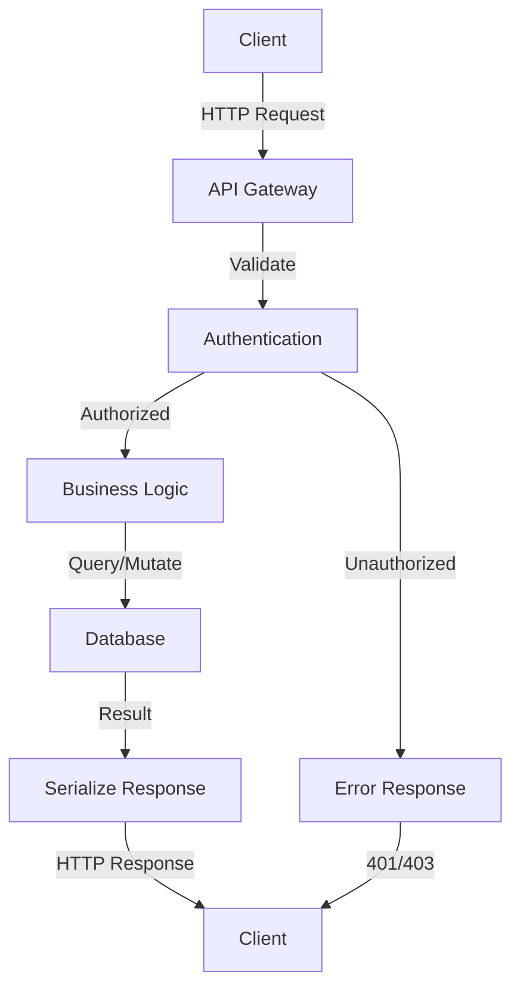

# API Endpoint Analysis - Summary

You are an expert API analyst. Analyze the provided OpenAPI endpoint specification and generate a comprehensive summary.

## Analysis Requirements

### 1. Endpoint Overview
- Provide a clear, concise description of what this endpoint does
- Explain its primary purpose and business value
- Identify the HTTP method and path

### 2. Detailed Description
- Elaborate on the endpoint's functionality
- Explain any complex business logic
- Highlight important behaviors and constraints
- Note any rate limiting or authentication requirements

### 3. Use Cases
- List 3-5 realistic use cases for this endpoint
- Describe the scenario, expected inputs, and expected outcomes
- Explain how this endpoint fits into typical API workflows

### 4. Request-Response Lifecycle
Document the complete lifecycle:
- **Request Phase**: How clients should construct and send requests
  - Required headers, authentication tokens, query parameters
  - Request body structure and validation rules
  - Content-type and encoding specifications
  
- **Processing Phase**: What happens on the server
  - Data validation steps
  - Authorization checks
  - Business logic execution
  
- **Response Phase**: What clients receive
  - Success response structure (HTTP 2xx)
  - Common error responses (4xx, 5xx) with meanings
  - Response headers and metadata
  - Pagination or streaming details if applicable

### 5. API Data Flow Diagram
Create a Mermaid diagram showing:
- Client → Request flow
- Server-side processing steps
- Database/external service interactions (if applicable)
- Response flow back to client
- Error handling paths

Use the following format:

### 6. Output Format
Structure your response in clear markdown sections with:
- Headers for each section
- Bullet points for lists
- Code blocks for examples (JSON, etc.)
- Tables for parameter descriptions where appropriate
- Mermaid diagram for data flow visualization

---

## Endpoint Specification
The following is the OpenAPI endpoint specification to analyze:

<json>
{ENDPOINT_SPECIFICATION}
<json>

---

**Generate the complete analysis now.**